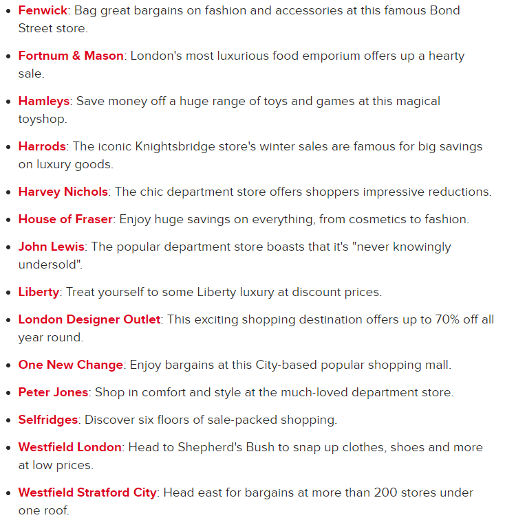

# London Tour 2018

`26th Dec. Boxing Day`

6:50-7:15 61 bus(Near Aldi)- St Martin's Queensway-Birmingham Coach Station

8:15-11:15 401 National Express London Victoria Coach Station

Around 12:00 Victoria Station - Oxford Circus Station/Green Park Station

Industry Burburry - Covent Garden - Carnaby Street - Oxford Street - Knightsbridge -Harrods&Chelsea -Westfield - Hyde Park

The searching branch on boxing day:

The perfume:

|Name|Making|
|--|--|
|Chanel Blue|Hermes Un Jardin Sur Le Nil|
|L'Artisan Parfumeur Passage d'Enfer冥府|Diptyque Tam Dao|
|Jo Malone Wild Bluebell|Tom Ford Oud Wood|
|Le Labo Santal 33|Tom Ford Grey Vetiver|
|Creed Aventus|Burberry (New) London|

`27th Dec.Thames River(Thur.)`

WestminsterPier To London Eye 10:40,11:20

London Eye To Tower 11:30,12:10,12:50,13:30

Tower to Greenwich 13:30,14:10,14:50,15:30

|time|via|destination|
|--|--|--|
|6:40-7:00|Home - Stratford Station||
|7:00-|Stratford Station 13Platform -Westminster Station||
|8:00-|St-James's Park SW1A 2BJ|Parliament St 10 Downing Steet|
|9:30-10:20|Westminster Abbey|House of Parliament BigBen|
|10:40-10:50|Westminster Pier - London Eye Pier||
|11:15-11:30 Entry 11:30-12:00|London Eye||
|12:10-13:20 12:50-14:00|London Eye Pier- Greenwich Pier||
|After 14:00|Cutty Shark|University of Greenwich National Maritime Museum Queen's House|
|15:00|Royal Greenwich Park|Royal Observatory|
|17:00-|Greenwich Station - London Bridge Station||
|Everning|Shard||

`28th Dec. Buckingham & Hyde Park(Fir.)`

| time                                       | via                                     | destination                 |
| ------------------------------------------ | --------------------------------------- | --------------------------- |
| 8:00-8:30                                  | Stratford Station - Greenpark Station   |                             |
|                                            | Green Park Around                       | Kensington Garden           |
| Hyde Garden                                |
| 09:30                                      | Churchill War Rooms                     |                             |
| 10:00                                      | St.James's Palace detachment            | Old Guard                   |
| On Friary Court                            |
| 10:25                                      | The Mall Road                           | Regimental Band             |
| Corps of Drums                             |
|                                            | The incoming of New Guard               | From Wellington Barracks    |
| Birdcage Walk                              |
| 11:00                                      | Changing of the Guard Buckingham Palace | Queen's Guard:              |
| 1st Battalion Irish Guards                 |
| Musical Support:                           |
| Band of the Coldstream Guards              |
| Drums or Pipes of the 1st Bn. Irish Guards |
| 11:35                                      | Attention                               | Old breaks into quick time  |
| New slope Arms                             |
| Around 12:00                               | The Queen's Gallery                     | The Guards Museum           |
| The Royal Mews                             | The Household Cavalry                   |
| Around                                     | Handel & Hendrix                        | Wellington Arch             |
| 13:00                                      |
| After                                      | Royal Albert Hall                       | Royal College of Music      |
| Tour 30min/Café Bar at Door 12             |
|                                            | Science Museum(closed 17:50)            | Science Museum 3D:          |
| Natural History Museum                     | Hubble 3D 15:15-16:15                   |
| Victoria and Albert Museum(closed 22:00)   | Abeautiful Peant 16:40-17:40            |
| After 17:00                                | Imperial College London                 | Hyde Park Winter Wonderland |
| Victoria and Albert Museum(closed 22:00)   |

`29th Dec. Tower of London(Sat.)`

| time           | via                                       | destination                |
| -------------- | ----------------------------------------- | -------------------------- |
| 8:04/06 - 8:20 | Straford Station - St Paul's Station      |                            |
| 8:30-10:00     | St Paul's Cathedral                       |                            |
| 10:30-12:00    | Tower of London                           | All Hallows Church         |
| Around 12:00   | Tower Bridge                              |                            |
| Around 13:00   | HMS Belfast                               |                            |
| 14:00          | Southwark Cathedral                       | Golden Hinde(closed 14:00) |
| 15:00          | Tate Modern                               |                            |
| After          | Borough Market                            |                            |
| Back           | London Bridge Station - Stratford Station |                            |

`30th Dec. Hop on Hop off(Sun.)`

Can only choosing one colour bus(Gloden blue)

Orange line 30min/ 

| time               | via                                                                                                |
| ------------------ | -------------------------------------------------------------------------------------------------- |
| 18                 | Straford Station - Waterloo Station - Charing Cross Station                                        |
|                    | Leicester Square, Trafalgar Square, St Martin-in-the-Fields                                        |
| First 8:40         | Monument Stop G(22 red)-23-24-25-30                                                                |
| 40min/before 11:20 | Shakespeare's Globe                                                                                |
|                    | Southwark Bridge Rd Stop BL(40 orange)-49-47-48-32-33-34-17-68-84                                  |
|                    | Baker Street                                                                                       |
| Last Entry 15:00   | London Zoo                                                                                         |
|                    | The Regent's Park                                                                                  |
| Last 19:34         | Albany Street Stop C(85 orange)-86-71-72-73-74-70-44-22-23-24-25-41-36-29-37-London Bridge Station |

`31st Dec. Hampton Court Palace(Tue.)`

| time        | via                                  |
| ----------- | ------------------------------------ |
| 8:06-8:42   | Waterloo Station  - Hampton Wick     |
| 8:36-9:12   |
| 9:00-10:00  | Formal Gardens Access                |
| 10:00-16:30 | Hampton Palace Opening Time          |
| 15:35-16:12 | Hampton Court - Waterloo Station     |
| 16:05-16:32 |
|             | Waterloo Station - Stratford Station |
| 17:00-18:00 | ArcelorMittal Orbit                  |

`1st Jan. Windsor Castle(Mon.)`
| time         | via                                                    | destination        |
| ------------ | ------------------------------------------------------ | ------------------ |
| 7:44-8:44    | Waterloo Station - Windsor Eton Riverside Station      |                    |
| 8:25-9:16    |
| 10:00-16:00  | Windsor Castle                                         | St George's Chapel |
| Eton Collage |
| 40min        | Windsor River Cruise                                   | Windsor Promenad   |
| Boveney Lock |
| 17:02-17:36  | Windsor and Eton Central - Slough - Paddington Station |                    |

`2ed Jan. Museum&Gallary(Thur.)`

| time                  | via                                      | destination      |
| --------------------- | ---------------------------------------- | ---------------- |
|                       | Stratford Station - Tottenham Court Road |                  |
| Open 10:00            | The British Museum                       |                  |
| Around 12:00          | LSE meet                                 |                  |
| Last 18:00            | The National Gallery                     | Trafalgar Square |
| 19:30                 | The Phantom of the Opera                 | K23 K24          |
| Her Majesty's Theatre |

`3rd Jan. Seven Sisters & Seaford To Eastbourne`

`London Tour 2rd Sept. 2019 with GangZhang`

9:45 Euston - Westminster Station -London Eye

10:50 Times River Cruise - London tower& Bridge

Tower Hill Station - Embarkment Station

Tarfalgar Square- St martin - Charing Cross Road-Cranbourn Street-兰州拉面

出门左拐Cranbourn Street - Piccadilly Circus- Old New Bond St- 左转Brook St-亨德尔故居 -斜插 到Bond Street Station - Knightsbridge - 哈罗德

Knightsbridge - Oxford Circus - 摄政街-回到piccadilly circus

Piccadilly Circus - Convent Garden

走到诺维罗剧院
